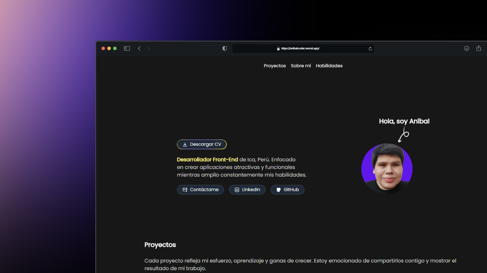

# 👨🏻‍💻 Porfolio personal

¡Bienvenido a mi portafolio personal! Descubre mis proyectos destacados, habilidades técnicas y el resultado de mi dedicación como desarrollador frontend. ¡Explóralo y conoce más sobre mi trabajo!

  

